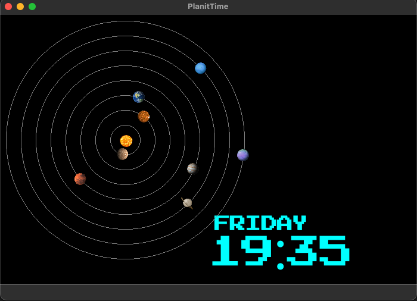

# Plan-it-time

Contributors (Which may or not be listed for one reason or another):

| Contributor Name | Description |
|------------------|-------------|
| Ishaan Kumar, [@gosnod](https://github.com/gosnod)    | Hardware expert, QA expert |
| Jenessa Lu,  [@tsuyuuu](https://github.com/tsuyuuu)      | Front end (look and feel) design, asteroid logic |
| Ammar Hussein, [@a1ges](https://github.com/a1ges)    | Designed logic for alarm system, and integrated it with hardware  |
| Nathan Halsey [@natehalsey](https://github.com/natehalsey)   | Designed solar widget and all of the associated logic |

Plan-it-time was a group project completed for 3307.

The aim of this project was to implement a software program which allows for the invocation of astronomical data from the Horizons API from NASA. The API provides programmatic access to planetary orbit information and is one of NASA's API’s available for development purposes.

After encountering issues with getting the raspberry pi connected to wifi, we began working on implementing a mathematical method for computing the current positions of the planets. As a result, we essentially created a digital orrery, while retaining accuracy. 

Plan It Time is a software based data visualizer that displays an accurate yet stylized representation of our solar system alongside the current date and time. It is built on top of sound mathematical methods for computing the positions of planets in the solar system and a GUI package which would implement upon C++ to provide a responsive UI. Plan It Time can display, at a glance, requested data visualizations of the planetary orbit positions, date and time, and function as a desktop clock with a built in alarm. 
