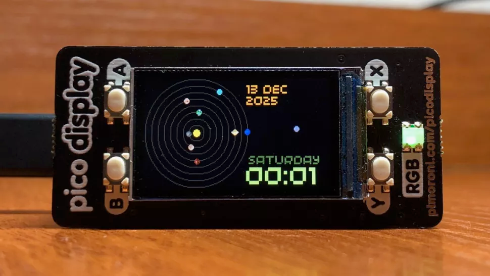

# Plan It Time

Motivation:

- Solar system display as main screen
    - Current date
    - current time
    - current position of planets
    - black background
    - kind-of retro bit style
    - we could put quotes here about being late :pepelaugh:
- Secondary screen google maps API
    - Travel time from current location to other location (select from bus, car, bike)
    - Shortest route from current location to other location

Hardware Considerations:

1. We need some way for the user to input current location, and location they're going to, could we have the user do this on their phone? Maybe it connects to their google calendar, or other calendar, maybe we could create a desktop app that connects to the clock that you can use to manipulate it. We want it to be sort-of set and forget
2. Board needs wifi
3. Board needs a screen
4. Board should look cool on a desk
5. need to think about how a user may want to extend this, maybe we could even incorperate ammars spotify idea if we have time!
6. could we automatically switch between screens if travel time is within a certain set of minutes, and send some type of push notification alerting the user on the screen, if so do we need sound? 

Extensions:
- Different fonts and text colours
